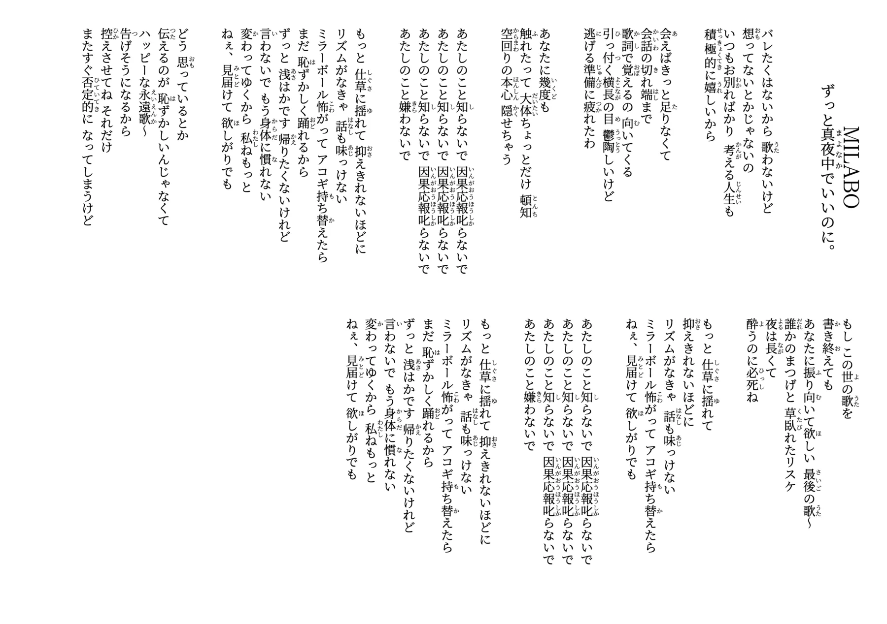

A collection of Japanese song lyrics typeset with LuaLaTeX in traditional vertical (i.e., tate, 縦) layout, with hiragana (平仮名) ruby annotations (i.e., furigana, 振り仮名) for kanji (漢字).



## Build

Requires LuaLaTeX and latexmk.

```sh
make        # compile all songs to out/
make clean  # remove build artifacts
```
